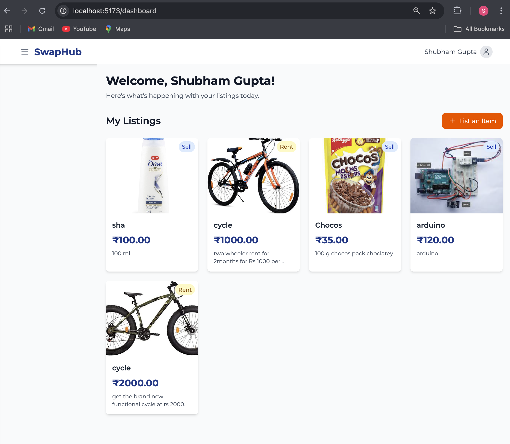
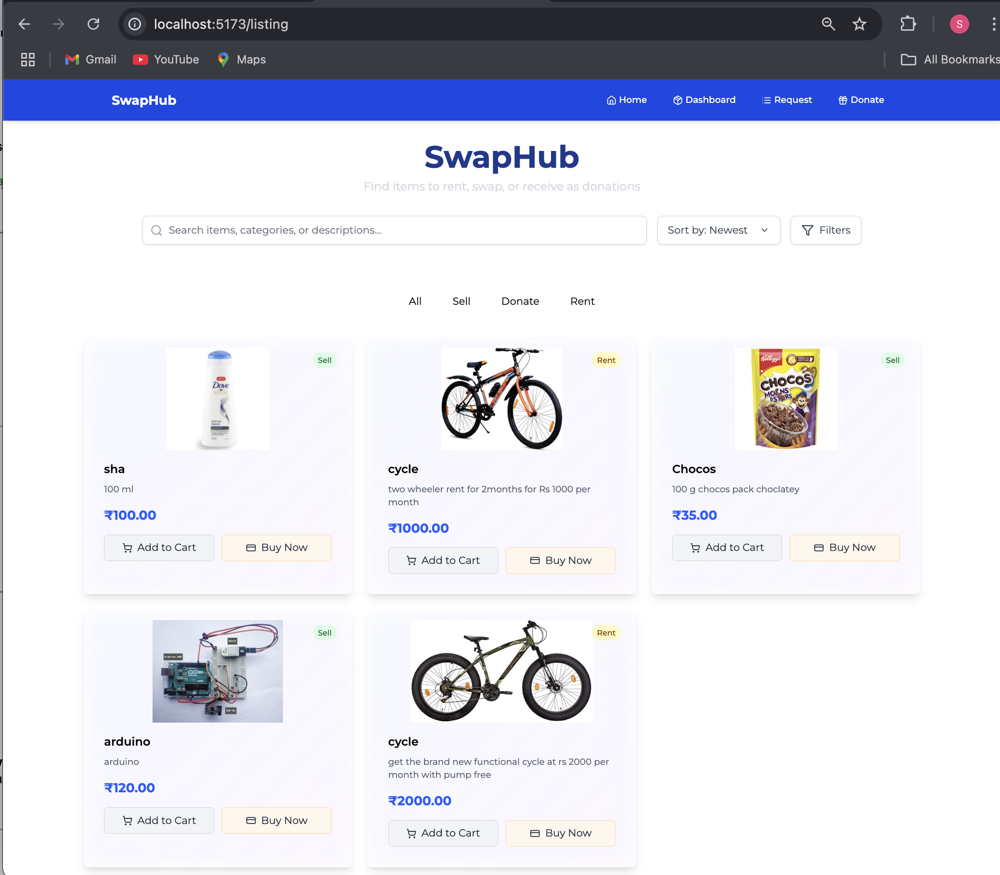

# SwapHub

## A College Marketplace Platform for Students

SwapHub is a comprehensive college platform designed specifically for students to buy, sell, donate, and rent items within their campus community. This platform streamlines the exchange of goods among students, promoting sustainability and resource sharing.



## 🎯 Overview

SwapHub connects students within the same college ecosystem, allowing them to:
- Buy and sell used textbooks, electronics, furniture, and more
- Donate items they no longer need to fellow students
- Rent items temporarily for short-term use
- Build a trusted community through ratings and reviews



## 🛠️ Technology Stack

### Backend
- **Node.js** with **Express.js** framework
- **MongoDB** for database storage
- **Mongoose** for object data modeling
- **Passport.js** for authentication

### Frontend
- **React.js** for interactive UI components
- **Redux** for state management
- **Material UI/Bootstrap** for styling
- **Axios** for API requests

### Authentication
- **Google OAuth** integration
- **Session-based authentication**
- **JWT** for secure API access

## 👥 User Roles & Features

### 1️⃣ Sellers
- Create and manage product listings
- Upload multiple product images
- Set prices and availability
- Respond to buyer inquiries
- Track listing statistics

### 2️⃣ Buyers
- Browse available items with advanced filtering
- Search for specific items across categories
- Contact sellers directly through the platform
- Save favorite items
- Complete secure transactions

### 3️⃣ Donors
- List items for donation
- Specify item condition and availability
- Connect with students in need
- Track donation history

## 💡 Additional Features

- **User Dashboard:** Personalized interface showing listings, transactions, and interactions
- **Sidebar Navigation:** Improved visibility and accessibility across all screen sizes
- **Rating & Reviews:** Comprehensive feedback system for building trust
- **Notification System:** Real-time updates on inquiries and transactions
- **Mobile Responsive:** Optimized experience on all devices

## 🔧 Installation

1. Clone the repository:
   ```bash
   git clone https://github.com/yourusername/swaphub.git
   cd swaphub
   ```

2. Install dependencies for both backend and frontend:
   ```bash
   # Install backend dependencies
   cd server
   npm install

   # Install frontend dependencies
   cd ../client
   npm install
   ```

3. Configure environment variables:
   - Create a `.env` file in the server directory
   - Add the following variables:
     ```
     PORT=5000
     MONGODB_URI=your_mongodb_connection_string
     GOOGLE_CLIENT_ID=your_google_client_id
     GOOGLE_CLIENT_SECRET=your_google_client_secret
     SESSION_SECRET=your_session_secret
     ```

4. Start the development environment:
   ```bash
   # Start backend server
   cd server
   npm run dev

   # Start frontend server in a new terminal
   cd client
   npm start
   ```

## 🚀 Usage

1. Register with your college email or Google account
2. Complete your profile details
3. Browse listings or create your first listing
4. Connect with other students for transactions
5. Leave feedback after completed transactions

## 📱 API Endpoints

### Authentication
- `POST /api/auth/register` - Register a new user
- `POST /api/auth/login` - Login user
- `GET /api/auth/google` - Google OAuth authentication
- `GET /api/auth/logout` - Logout user

### Listings
- `GET /api/listings` - Get all listings
- `GET /api/listings/:id` - Get specific listing
- `POST /api/listings` - Create new listing
- `PUT /api/listings/:id` - Update listing
- `DELETE /api/listings/:id` - Delete listing

### Users
- `GET /api/users/profile` - Get user profile
- `PUT /api/users/profile` - Update user profile
- `GET /api/users/:id/listings` - Get user's listings
- `GET /api/users/:id/reviews` - Get user's reviews

## 🤝 Contributing

We welcome contributions to SwapHub! Please follow these steps:

1. Fork the repository
2. Create your feature branch (`git checkout -b feature/amazing-feature`)
3. Commit your changes (`git commit -m 'Add some amazing feature'`)
4. Push to the branch (`git push origin feature/amazing-feature`)
5. Open a Pull Request

## 📄 License

This project is licensed under the MIT License - see the [LICENSE](LICENSE) file for details.

## 📬 Contact

Project Link: [https://github.com/yourusername/swaphub](https://github.com/yourusername/swaphub)

## 🙏 Acknowledgements

- [MongoDB](https://www.mongodb.com/)
- [Express.js](https://expressjs.com/)
- [React.js](https://reactjs.org/)
- [Node.js](https://nodejs.org/)
- [Passport.js](http://www.passportjs.org/)
